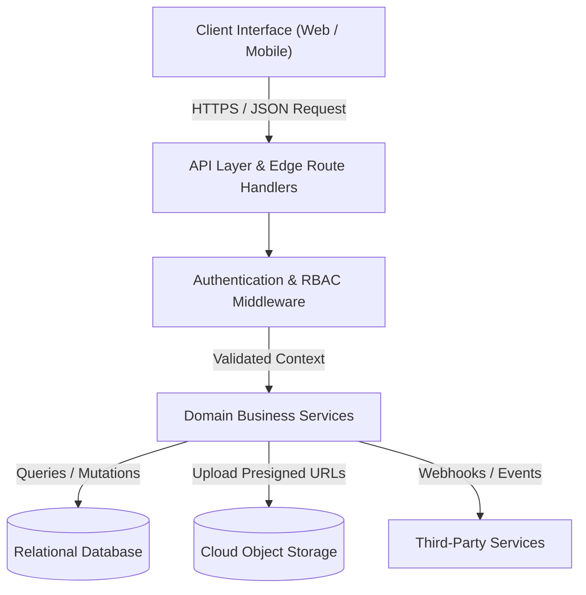
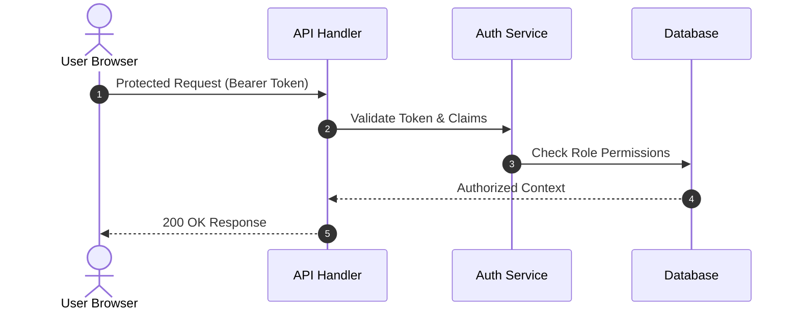

# Prompt 01: Greenfield New Project Kickoff

> **When to use:** Paste this into Claude Code as message #1 when starting a brand-new project from scratch in an empty directory.  
> **What it does:** Interviews you on the project scope, agrees on the tech stack, initializes clean architecture directories, sets up the root `CLAUDE.md` pointer and public `README.md`, and scaffolds the `brain/` directory with operational rules, device sync, and a complete PDF-ready SRS document.

---

```markdown
You are setting up a brand-new software project following professional Clean Architecture and modular system standards. Follow these steps in order, and do NOT skip any step.

Important: In the instructions below, content between "=== FILE START ===" and "=== FILE END ===" represents exact template file contents. All other text represents instructions for you.

---

### STEP 1 — Scope Interview & Tech Stack Agreement
Start here before generating any code or files:
1. Ask me what the project is, who it is for, and what its primary features are.
2. Based on my answers, recommend the optimal tech stack (frontend, backend, database, auth, hosting). Explain the tradeoffs and why this stack fits the project's specific goals.
3. Discuss and confirm the final stack with me before proceeding to file creation.

---

### STEP 2 — Initialize Hygiene & Environment
Once the stack is agreed upon:
1. Initialize the project scaffolding using clean, feature-based architecture (e.g., `src/features/` or `src/modules/`).
2. Create a complete `.gitignore` file that strictly excludes:
   - Environment files (`.env`, `.env.local`, `.env.*.local`)
   - Dependencies (`node_modules/`, `venv/`, `__pycache__/`)
   - Build artifacts (`dist/`, `build/`, `.next/`, `out/`)
   - OS/Editor junk (`.DS_Store`, `.idea/`, `.vscode/`)
3. Create `.env.example` containing descriptive placeholder keys for all required environment variables without real secrets.

---

### STEP 3 — Create Root Pointer & Public README
Create two clean files at the project root:

#### File 1: `CLAUDE.md` (Root Pointer)
This file is automatically loaded by Claude Code on session start. Keep it lean (under 25 lines) to act strictly as a pointer:

=== FILE START ===
# [Project Name]

> **Stack:** [Framework / Language / Database / Services agreed in Step 1]  
> **Environment:** Runtime [Node.js / Python version], package manager [npm/pnpm/pip]

---

## System Architecture & Cognitive Engine
All operational memory, engineering rules, and system documentation live in the `brain/` directory.

- **On session start**:
  1. Inspect `brain/state.md` and `brain/rules.md`.
  2. Provide a 2-line ambient status snapshot (current milestone & immediate next step) before executing any task.
- **Active Shortcuts**:
  - `catch-me-up` : Read `brain/state.md` + `brain/sync.md`, inspect git, and provide a full 30-second context briefing.
  - `wrap-up`     : Update `brain/state.md`, `brain/progress.md`, `brain/sync.md`, and `brain/documentation/SRS.md` before finishing work.
  - `commit`      : Audit staged changes for secrets/temp files, generate a descriptive commit message, and push to GitHub.
  - `plan`        : Outline approach + rejected alternative before coding non-trivial changes.
=== FILE END ===

#### File 2: `README.md` (Public Facing)
A professional, public GitHub README containing:
- Project title and 2-sentence mission statement.
- Key features list.
- Tech stack overview.
- Prerequisites & local installation/run commands.

---

### STEP 4 — Scaffold the `brain/` Cognitive Engine
Create the `brain/` directory and populate the 5 internal operational files:

#### File 1: `brain/state.md` (Frozen Working Memory for `catch-me-up`)
=== FILE START ===
# Active Working Memory (`state.md`)

> **Last Updated:** [Today's Date]  
> **Active Branch:** main  
> **Status:** Project Initialized

---

## 1. 🗺️ System Snapshot (3-Sentence Context)
[Brief 2-3 sentence overview of what the application does, who it's for, and current milestone.]

---

## 2. 📍 Where We Stopped
- **Current Milestone / Feature:** Project scaffolding & environment setup.
- **Last File(s) Touched:** `CLAUDE.md`, `README.md`, `brain/` files.
- **Completed in Last Session:** Project initialized and rules established.

---

## 3. 🚧 In-Flight Work & Unfinished Threads
- [ ] Implement initial domain model / database schema.
- [ ] Configure core application routing and layouts.

---

## 4. 🎯 Immediate Next Step (Start Here)
> **Action:** [Specify the exact first file and feature to start building]  
> **Command to Run (if any):** `[e.g. npm run dev]`
=== FILE END ===

#### File 2: `brain/progress.md` (Historical Session Log)
=== FILE START ===
# Progress Changelog (`progress.md`)

> Chronological log of completed sessions and milestones. Newest entries stay at the top.

---

## [Today's Date] — Project Initialization & Architecture Setup
- Scaffolded project structure and agreed on stack: [Stack summary].
- Initialized `brain/` context engine (`state.md`, `rules.md`, `sync.md`, `SRS.md`).
- Configured clean architecture standards and security rules.
=== FILE END ===

#### File 3: `brain/sync.md` (Cross-Device Handover Engine)
=== FILE START ===
# Cross-Device Sync State (`sync.md`)

> **Role:** Multi-machine state synchronizer. Updated by `wrap-up`, read by `catch-me-up`.

---

## 1. 💻 Machine & Git Handover
- **Last Active Machine:** Machine-1 (Initialization)
- **Last Sync Timestamp:** [Today's Date and Time]
- **Active Git Branch:** main
- **Last Pushed Commit:** Initial project setup
- **Local Uncommitted Changes Left Behind:** None

---

## 2. 🔑 Environment & Secrets Reconciliation
- **New `.env` Variables Added Since Last Sync:**
  - [ ] None (Initial setup)

---

## 3. 📦 Dependencies & Runtime Setup
- **Package Manager Action Required on Machine B:**
  - [ ] Run initial install (`npm install` / `pip install`)

---

## 4. 🗄️ Database & Schema Migrations
- **Migration Action Required on Machine B:**
  - [ ] Run initial database migration once database is connected

---

## 5. 📝 Handover Notes for the Other Machine
Initial setup complete. Ready to begin feature implementation.
=== FILE END ===

#### File 4: `brain/rules.md` (Clean Architecture & Shortcuts)
=== FILE START ===
# Project Operational Rules & Standards (`rules.md`)

## 1. 🛡️ HARD SECURITY RULES (Never Violate)
1. **Never Commit Secrets**: Never commit `.env` files, API keys, private tokens, or credentials.
2. **Media Storage**: Never store media files (images, audio, videos, PDFs) as blobs directly in the database. Upload to cloud object storage and store only the resulting URL in the database.
3. **Destructive Actions**: Never drop tables, reset databases, delete files wholesale, or force-push without explicit, written confirmation.
4. **Server-Side Authority**: Never trust client-side validation for security. Always enforce authentication, role permissions (RBAC), and input sanitization on the server.
5. **No Leaked Internals**: Never return raw database errors, environment variables, or server stack traces to client responses.
6. **No Unapproved Dependencies**: Always ask before installing new packages, adding tools, or restructuring core directories.

## 2. 🏛️ CLEAN ARCHITECTURE & PROFESSIONAL CODE STANDARDS
1. **Feature/Domain Modularity**: Group code by domain/feature (e.g., `src/features/auth/`, `src/modules/billing/`) containing its own components, hooks, services, and types. Never dump flat lists of files into generic directories.
2. **Strict Layer Separation**: UI components must focus exclusively on presentation. Data fetching and business logic belong in dedicated service/repository layers. UI must never call databases or external APIs directly.
3. **Zero Dead Code & Speculative Wrappers**: Do not write abstractions or utility functions "just in case". Clean up unused imports, dead functions, and commented-out code blocks immediately.
4. **Data Validation & Type Safety**: Validate all external inputs (API request bodies, URL query params, forms) using schema validators (e.g., Zod, Pydantic). Avoid `any` types.
5. **Single Source of Truth**: Centralize constants, environment configurations, and design tokens. Never hardcode magic strings, hex colors, or endpoint URLs inside component logic.

## 3. ⚡ SESSION SHORTCUTS WORKFLOW

### `catch-me-up` (or `catch me up`)
- Read `brain/state.md` and `brain/sync.md`.
- Inspect git status and recent commits (`git log -n 3`).
- Output a concise 30-second briefing:
  - **Project Snapshot:** 2-sentence reminder of project purpose.
  - **Where We Stopped:** Last completed feature & active branch.
  - **Cross-Device Status:** Flag any pending `.env` keys, package installs, or migrations from `sync.md`.
  - **Immediate Next Step:** Exact file, function, and task to start right now.

### `wrap-up` (or `wrap up`)
- Freeze working memory in `brain/state.md`: Update where we stopped, in-flight work, and the exact next step.
- Append a dated summary to `brain/progress.md`.
- If new features or architectural changes occurred, update `brain/documentation/SRS.md`.
- If public features or setup steps changed, update root `README.md`.
- Update `brain/sync.md` with current branch, commit, required `.env` variables, and dependency/migration commands.
- **Safety:** Updates documentation only. Does NOT automatically commit or push to git.
- Confirm with a summary: *"Wrap-up complete. All brain state updated. Ready for 'commit' or device switch."*

### `commit`
- Run `git status` and stage files.
- Audit staged files: Ensure no `.env`, secrets, large binaries, or temp artifacts are staged. If detected, ABORT and warn.
- Generate a concise, conventional commit message reflecting the real changes.
- Commit and push to origin.
- Confirm with commit hash and pushed branch.

### `plan`
- Propose implementation strategy and at least one rejected alternative with tradeoffs.
- Stop and wait for user approval before writing code.
=== FILE END ===

#### File 5: `brain/documentation/SRS.md` (System Requirements Specification — PDF Ready)
Create `brain/documentation/SRS.md` populated with the real project details settled during Step 1. You MUST follow this exact ISO/IEC/IEEE 29148 structure:

=== FILE START ===
# System Requirements Specification (SRS)
## Project: [Project Name]

| Attribute | Details |
| :--- | :--- |
| **Document Version** | 1.0.0 |
| **Status** | Active / Under Development |
| **Last Updated** | [Today's Date] |
| **Lead Developer / Author** | [Author Name] |
| **Primary Repository** | [GitHub Repository URL] |

---

## 1. Executive Summary & Vision

### 1.1 Problem Statement
[Problem this software solves, target user base, pain points eliminated.]

### 1.2 Proposed Solution & Objectives
[Core value proposition and high-level deliverables.]

### 1.3 Target Audience & Stakeholders
- **Primary Users:** [End-users, admins, operators]
- **Key Stakeholders:** [Product owner, technical team]

---

## 2. High-Level Architecture & Tech Stack

### 2.1 Architectural Pattern
- **Pattern:** [Modular Monolith / Clean Architecture / Event-Driven]
- **Rationale:** [Why this architecture was chosen for this project]

### 2.2 Technology Stack Matrix

| Layer | Technology | Version | Purpose & Rationale |
| :--- | :--- | :--- | :--- |
| **Frontend Framework** | [Agreed Framework] | [Version] | [Role in project] |
| **Styling & Tokens** | [Tailwind / CSS] | [Version] | [Design system approach] |
| **Backend & Runtime** | [Agreed Runtime] | [Version] | [API and business services] |
| **Database** | [Agreed DB] | [Version] | [Data persistence] |
| **ORM / Data Access** | [Agreed ORM] | [Version] | [Type-safe data modeling] |
| **Authentication** | [Agreed Auth] | [Version] | [User sessions & RBAC] |
| **Object Storage** | [Agreed Storage] | [Version] | [Media and asset blobs] |
| **Hosting & Infra** | [Agreed Hosting] | [Version] | [Deployment infrastructure] |

### 2.3 Component & Data Flow Diagram



---

## 3. Functional Requirements (Module Breakdown)

### 3.1 Module: [Core Feature Module 1]
- **Description:** [Purpose]
- **Key Capabilities:**
  - `FR-1.1`: [Feature description]
  - `FR-1.2`: [Feature description]
- **Validation & Business Rules:**
  - [Enforced business rules]

---

## 4. Data Architecture & Entity Relationships

### 4.1 Data Storage Philosophy
- Structured tables with foreign key integrity. Media stored in cloud object storage with URLs in DB.

### 4.2 Core Data Dictionary

| Entity / Table | Field | Data Type | Constraints | Description |
| :--- | :--- | :--- | :--- | :--- |
| **users** | `id` | UUID / TEXT | Primary Key | Unique user identifier |
| | `email` | VARCHAR(255) | UNIQUE, NOT NULL | Primary login email |
| | `created_at` | TIMESTAMPTZ | DEFAULT NOW() | Record creation timestamp |

---

## 5. API & Integration Surface

### 5.1 Internal Endpoints

| Method | Endpoint / Route | Auth Required | Description |
| :--- | :--- | :--- | :--- |
| `POST` | `/api/auth/...` | No | Initial authentication |
| `GET` | `/api/...` | Yes | Core data retrieval |

---

## 6. Security, Compliance & Data Protection

### 6.1 Authentication & Authorization Flow



### 6.2 Data Security Policy
- Server-side schema validation (Zod/Pydantic) on all mutation routes.
- SQL injection prevention via parameterized ORM queries.
- Zero secrets committed to source control.

---

## 7. Deployment & Operational Guide

### 7.1 Environment Variables Matrix

| Variable Key | Required | Example | Purpose |
| :--- | :--- | :--- | :--- |
| `DATABASE_URL` | Yes | `postgresql://...` | Connection string |
| `APP_SECRET` | Yes | `hex-string` | Cryptographic secret |

### 7.2 Run & Build Commands
- **Install:** `npm install`
- **Development:** `npm run dev`
- **Build:** `npm run build`
=== FILE END ===

---

### STEP 5 — Confirmation & Readiness
1. Output a short 4-line summary of what was scaffolded.
2. Explicitly confirm:
   **"Setup complete — the shortcuts are active."**
```
