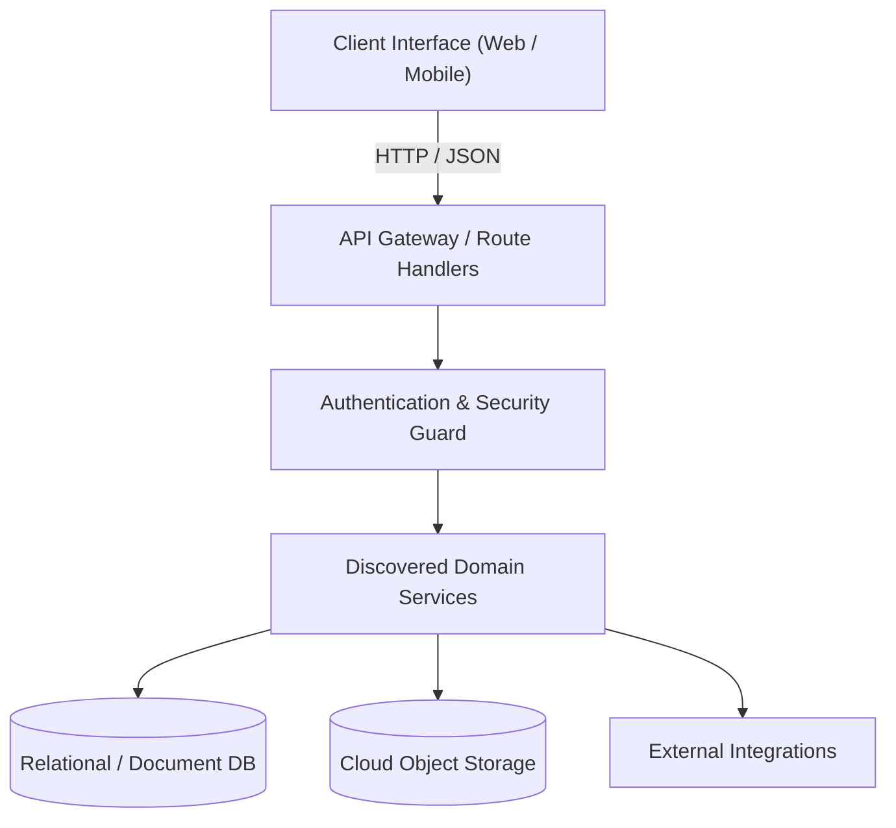
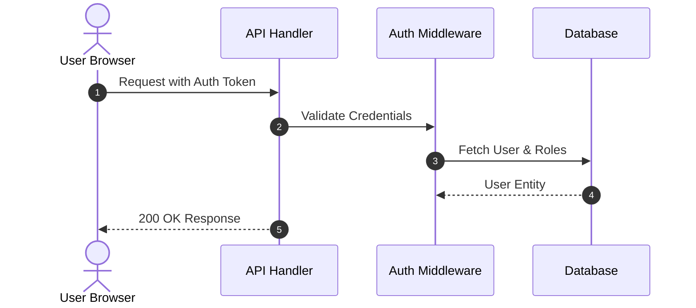

# Prompt 02: Brownfield Existing Project Adoption

> **When to use:** Paste this into Claude Code inside an existing project that already has code written, but lacks the `brain/` context system, rules, and SRS documentation.  
> **What it does:** Safely audits the codebase without deleting or altering any existing code, sets up the root `CLAUDE.md` pointer, reverse-engineers the existing architecture into a complete PDF-ready SRS document, and initializes `brain/` memory and shortcuts.

---

```markdown
You are adopting an existing codebase into a professional, modular project system. Your goal is to establish the `brain/` cognitive architecture, create a comprehensive System Requirements Specification (SRS) by analyzing the existing code, and activate session shortcuts.

CRITICAL SAFETY DIRECTIVE:
- Do NOT delete, rewrite, or reset any existing application code or database files.
- Do NOT overwrite existing documentation blindly. If a file (like README.md) already exists, read it first and preserve all accurate information.
- All internal operational files belong inside `brain/`.

Follow these steps in order:

---

### STEP 1 — Non-Destructive Codebase Audit
Scan the project to understand what currently exists:
1. Identify the tech stack by reading package manifests (`package.json`, `requirements.txt`, `pyproject.toml`, `Cargo.toml`, etc.), configs, and dependencies.
2. Inspect the directory tree to identify architectural patterns, existing modules, database schemas, and entry points.
3. Check for existing documentation, `.gitignore`, and `.env.example`.
4. Provide me with a concise 5-bullet summary of what you discovered:
   - Framework & Language
   - Database / ORM & Storage
   - Main Architectural Modules
   - Current Completion State
   - Any immediate hygiene issues (e.g. unignored secrets)

---

### STEP 2 — Setup Root CLAUDE.md Pointer
Create or update `CLAUDE.md` at the project root. If an existing `CLAUDE.md` exists, preserve any project-specific commands and prepend/append this standard pointer:

=== FILE START ===
# [Project Name]

> **Stack:** [Discovered Stack]  
> **Environment:** Runtime [Discovered Version], package manager [npm/pnpm/pip]

---

## System Architecture & Cognitive Engine
All operational memory, engineering rules, and system documentation live in the `brain/` directory.

- **On session start**:
  1. Inspect `brain/state.md` and `brain/rules.md`.
  2. Provide a 2-line ambient status snapshot (current milestone & immediate next step) before executing any task.
- **Active Shortcuts**:
  - `catch-me-up` : Read `brain/state.md` + `brain/sync.md`, inspect git, and provide a full 30-second context briefing.
  - `wrap-up`     : Update `brain/state.md`, `brain/progress.md`, `brain/sync.md`, and `brain/documentation/SRS.md` before finishing work.
  - `commit`      : Audit staged changes for secrets/temp files, generate a descriptive commit message, and push to GitHub.
  - `plan`        : Outline approach + rejected alternative before coding non-trivial changes.
=== FILE END ===

---

### STEP 3 — Reconcile Git & Secrets Hygiene
1. Check `.gitignore`. Ensure `.env`, `.env.*.local`, dependencies (`node_modules`, `venv`), and build directories are strictly excluded. If missing, append them.
2. Check `.env.example`. Ensure every environment variable referenced in the code is documented with a placeholder key.

---

### STEP 4 — Scaffold the `brain/` Cognitive Engine
Create the `brain/` directory and populate the 5 internal operational files using the discoveries from Step 1:

#### File 1: `brain/state.md` (Active Working Memory for `catch-me-up`)
Reconstruct current state from the codebase:
- **System Snapshot:** 2-3 sentence overview of what the application does.
- **Where We Stopped:** The most recently edited files or latest feature visible in git.
- **In-Flight Work:** Any partial implementations, unhandled TODOs, or open bugs found in the code.
- **Immediate Next Step:** Recommended next action to continue development.

#### File 2: `brain/progress.md` (Changelog)
Create `brain/progress.md` with an initial entry:
- Date: [Today's Date] — Project Adoption & Brain Initialization
- Summary of existing features and modules cataloged during onboarding.

#### File 3: `brain/sync.md` (Cross-Device Sync State)
- Current branch, commit hash, required `.env` variables from `.env.example`, and package install commands.

#### File 4: `brain/rules.md` (Clean Architecture & Shortcuts)
=== FILE START ===
# Project Operational Rules & Standards (`rules.md`)

## 1. 🛡️ HARD SECURITY RULES (Never Violate)
1. **Never Commit Secrets**: Never commit `.env` files, API keys, private tokens, or credentials.
2. **Media Storage**: Never store media files directly in database tables; upload to object storage and store URLs only.
3. **Destructive Actions**: Never drop tables, reset databases, delete files wholesale, or force-push without explicit, written confirmation.
4. **Server-Side Authority**: Enforce authentication, role permissions (RBAC), and input sanitization on the server.
5. **No Leaked Internals**: Never return raw database errors or server stack traces to client responses.
6. **No Unapproved Dependencies**: Always ask before installing new packages or restructuring core directories.

## 2. 🏛️ CLEAN ARCHITECTURE & PROFESSIONAL CODE STANDARDS
1. **Feature/Domain Modularity**: Group code by domain/feature. Avoid flat dumping of dozens of files into generic directories.
2. **Strict Layer Separation**: UI components must focus on presentation. Data access and business logic live in separate service/repository layers.
3. **Zero Dead Code & Speculative Wrappers**: No speculative helper functions. Clean up unused imports, dead functions, and commented-out code.
4. **Data Validation & Type Safety**: Validate all external inputs with schema validators (e.g. Zod, Pydantic). Avoid `any` types.
5. **Single Source of Truth**: Centralize constants, configs, and design tokens.

## 3. ⚡ SESSION SHORTCUTS WORKFLOW

### `catch-me-up` (or `catch me up`)
- Read `brain/state.md` and `brain/sync.md`.
- Inspect git status and recent commits (`git log -n 3`).
- Output a concise 30-second briefing:
  - **Project Snapshot:** 2-sentence reminder of project purpose.
  - **Where We Stopped:** Last completed feature & active branch.
  - **Cross-Device Status:** Flag any pending `.env` keys, package installs, or migrations from `sync.md`.
  - **Immediate Next Step:** Exact file, function, and task to start right now.

### `wrap-up` (or `wrap up`)
- Freeze working memory in `brain/state.md`: Update where we stopped, in-flight work, and the exact next step.
- Append a dated summary to `brain/progress.md`.
- If new features or architectural changes occurred, update `brain/documentation/SRS.md`.
- If public features or setup steps changed, update root `README.md`.
- Update `brain/sync.md` with current branch, commit, required `.env` variables, and dependency/migration commands.
- **Safety:** Updates documentation only. Does NOT automatically commit or push to git.
- Confirm with a summary: *"Wrap-up complete. All brain state updated. Ready for 'commit' or device switch."*

### `commit`
- Run `git status` and stage files.
- Audit staged files: Ensure no `.env`, secrets, large binaries, or temp artifacts are staged.
- Generate a concise, conventional commit message reflecting real changes.
- Commit and push to origin.
- Confirm with commit hash and pushed branch.

### `plan`
- Propose implementation strategy and at least one rejected alternative with tradeoffs.
- Stop and wait for user approval before writing code.
=== FILE END ===

#### File 5: `brain/documentation/SRS.md` (Reverse-Engineered Specification — PDF Ready)
Create `brain/documentation/SRS.md` by reverse-engineering the codebase. You MUST follow this exact ISO/IEC/IEEE 29148 structure:

=== FILE START ===
# System Requirements Specification (SRS)
## Project: [Discovered Project Name]

| Attribute | Details |
| :--- | :--- |
| **Document Version** | 1.0.0 |
| **Status** | Active / Existing Codebase |
| **Last Updated** | [Today's Date] |
| **Lead Developer / Author** | [Author / Team Name] |
| **Primary Repository** | [GitHub Repository URL] |

---

## 1. Executive Summary & Vision

### 1.1 Problem Statement
[Synthesize from existing README and code comments: what problem this codebase solves.]

### 1.2 Proposed Solution & Objectives
[Core application purpose and capabilities.]

### 1.3 Target Audience & Stakeholders
- **Primary Users:** [Identified user roles from code/auth]
- **Key Stakeholders:** [Engineering & Product team]

---

## 2. High-Level Architecture & Tech Stack

### 2.1 Architectural Pattern
- **Pattern:** [Identified architecture pattern, e.g. MVC, Clean Architecture, Feature-based modular]
- **Rationale:** [Observed codebase architecture]

### 2.2 Technology Stack Matrix

| Layer | Technology | Version | Purpose & Rationale |
| :--- | :--- | :--- | :--- |
| **Frontend Framework** | [Discovered Frontend] | [Version] | [Role in project] |
| **Styling & Tokens** | [Discovered CSS/Styling] | [Version] | [Design system approach] |
| **Backend & Runtime** | [Discovered Backend] | [Version] | [API and services] |
| **Database** | [Discovered DB] | [Version] | [Data persistence] |
| **ORM / Data Access** | [Discovered ORM] | [Version] | [Schema and query handling] |
| **Authentication** | [Discovered Auth] | [Version] | [Session management] |
| **Object Storage** | [Discovered Storage] | [Version] | [Asset storage] |
| **Hosting & Infra** | [Discovered Infra] | [Version] | [Deployment setup] |

### 2.3 Component & Data Flow Diagram



---

## 3. Functional Requirements (Module Breakdown)

### 3.1 Module: [Discovered Module 1]
- **Description:** [Functionality identified in codebase]
- **Key Capabilities:**
  - `FR-1.1`: [Discovered capability]
  - `FR-1.2`: [Discovered capability]
- **Validation & Business Rules:**
  - [Observed validation rules]

---

## 4. Data Architecture & Entity Relationships

### 4.1 Data Storage Philosophy
- Documented from database schema/models found in codebase.

### 4.2 Core Data Dictionary

| Entity / Table | Field | Data Type | Constraints | Description |
| :--- | :--- | :--- | :--- | :--- |
| **[Discovered Table]** | `id` | UUID / INT | Primary Key | Identifier |
| | `[field]` | [type] | [constraints] | [purpose] |

---

## 5. API & Integration Surface

### 5.1 Internal Endpoints

| Method | Endpoint / Route | Auth Required | Description |
| :--- | :--- | :--- | :--- |
| `[METHOD]` | `[ROUTE]` | [Yes/No] | [Observed handler role] |

---

## 6. Security, Compliance & Data Protection

### 6.1 Authentication & Authorization Flow



### 6.2 Data Security Policy
- Identified sanitization, parameterized queries, and environment variable protections.

---

## 7. Deployment & Operational Guide

### 7.1 Environment Variables Matrix

| Variable Key | Required | Example | Purpose |
| :--- | :--- | :--- | :--- |
| `[KEY]` | Yes | `[value-format]` | [Extracted from .env.example / code] |

### 7.2 Run & Build Commands
- **Install:** [Discovered command, e.g. `npm install`]
- **Development:** [Discovered command, e.g. `npm run dev`]
- **Build:** [Discovered command, e.g. `npm run build`]
=== FILE END ===

---

### STEP 5 — Confirmation & Readiness
1. Output a short summary of the discovered architecture, files created, and any assumptions made during reverse engineering.
2. Explicitly confirm:
   **"Setup complete — the shortcuts are active."**
```
